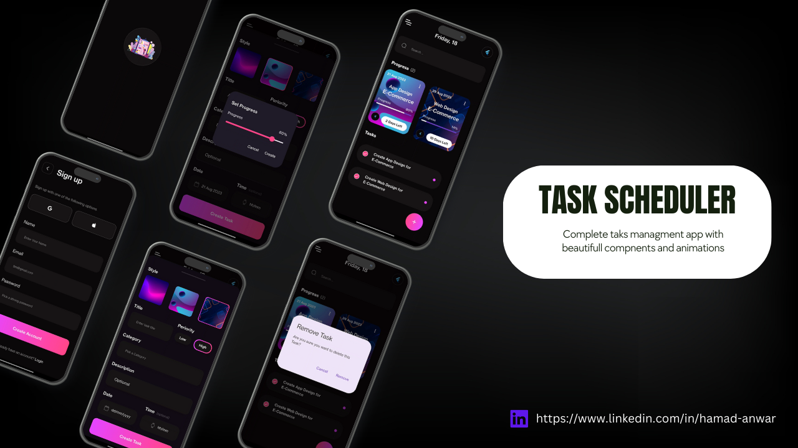

# Beautiful Task Scheduler App

Welcome to the Beautiful Task Scheduler App repository! This Flutter-based task management application combines elegant design with a robust backend, ensuring a seamless and organized task management experience. From stunning UI to real-time synchronization, this app has you covered.

## Screenshots

## Features

- **Stunning UI**: Immerse yourself in a visually captivating user interface designed to enhance your task management experience.

- **Optimized Backend**: The app's backend is finely tuned for optimal performance, ensuring smooth navigation and operation.

- **Offline Access**: With Sqflite integration, the app remains fully functional even when offline, so you can manage tasks without interruptions.

- **Real-time Sync**: The Firebase Realtime Database powers real-time synchronization of tasks across multiple devices, making sure your tasks are up-to-date everywhere.

- **Multi-Device Experience**: Create, update, or delete tasks on one device and see the changes instantly reflected on all devices linked to your account.

- **Secure Authentication**: Firebase Authentication ensures the security of your tasks and data, allowing you to manage your to-dos with peace of mind.

- **Authentication and Session Management**: Utilizing Firebase Authentication and the `firebase_auth` package, the app provides a robust user authentication system. The session management is handled seamlessly, allowing users to securely access their tasks.

## Installation

1. Clone this repository using `git clone https://github.com/Hamad-Anwar/Task-Sync-Pro-Flutter.git
2. Navigate to the project directory: `cd task-scheduler-app`
3. Install dependencies: `flutter pub get`
4. **Add `google-services.json`:** For Firebase setup, each developer needs to add their own `google-services.json` file obtained from their Firebase project. Place this file in the `android/app` directory.

5. **Set Up Firebase Authentication:**
   - Go to the Firebase Console and create a project.
   - Enable the Email/Password sign-in method.
   - Add your Android app to the project and download the `google-services.json` file.
   - Add your iOS app if needed and download the `GoogleService-Info.plist` file.

6. **Set Up Firebase Realtime Database:**
   - In the Firebase Console, create a Realtime Database.
   - Set up security rules as per your requirements.
   - Update the Firebase configuration in your Flutter app code.

7. Run the app: `flutter run`

## Dependencies

This app utilizes the following dependencies:

- **google_fonts: ^5.1.0**: Provides easy access to a wide range of Google Fonts for consistent and appealing typography in the app.

- **get: ^4.6.5**: Offers a clean and reactive state management solution for your Flutter app, simplifying UI updates and interactions.

- **email_validator: ^2.1.17**: Allows you to validate email addresses, ensuring accurate input during user registration and login.

- **font_awesome_flutter: ^10.5.0**: Grants access to a comprehensive library of FontAwesome icons to enhance the visual elements of your app.

- **firebase_core: ^2.15.1**: Essential for initializing and connecting your Flutter app with Firebase services.

- **firebase_auth: ^4.7.3**: Enables robust user authentication using various methods, enhancing app security.

- **firebase_database: ^10.2.5**: Provides integration with the Firebase Realtime Database for real-time synchronization of tasks.

- **shared_preferences: ^2.2.0**: Allows you to store simple key-value pairs on the device, facilitating data persistence.

- **google_sign_in: ^6.1.4**: Streamlines the integration of Google Sign-In functionality for user authentication.

- **sign_in_with_apple: ^5.0.0**: Simplifies the process of adding Apple Sign-In as an authentication option in your app.

- **flutter_svg: ^2.0.7**: Renders SVG images, offering a scalable and resolution-independent solution for graphics.

- **intl: ^0.18.1**: Provides internationalization and localization support, making your app accessible to users from different regions.

- **sqflite: ^2.3.0**: Offers local database capabilities, enabling offline access and data storage even when the app is not connected to the internet.

- **connectivity: ^3.0.6**: Monitors network connectivity, allowing you to adapt your app's behavior based on the user's internet status.

## Contributions

Contributions are welcome! If you find a bug or want to add new features, feel free to open an issue or submit a pull request. Please follow our [contribution guidelines](/CONTRIBUTING.md).

## License

This project is licensed under the [MIT License](/LICENSE).

---

### Designed and developed with ❤️ by [Hamad Anwar](https://www.linkedin.com/in/hamad-anwar/).
